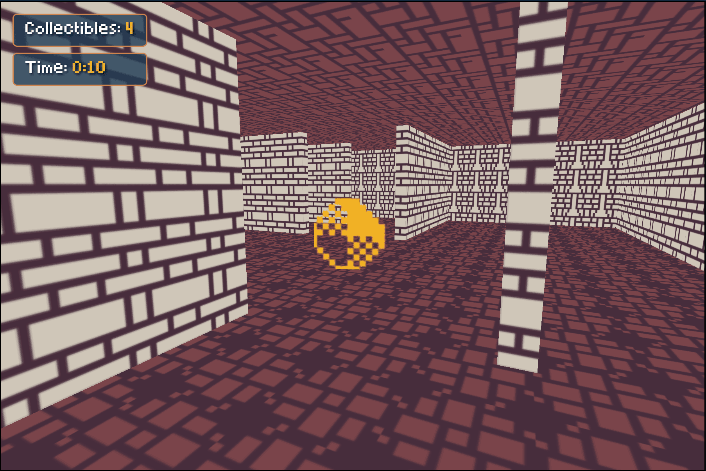
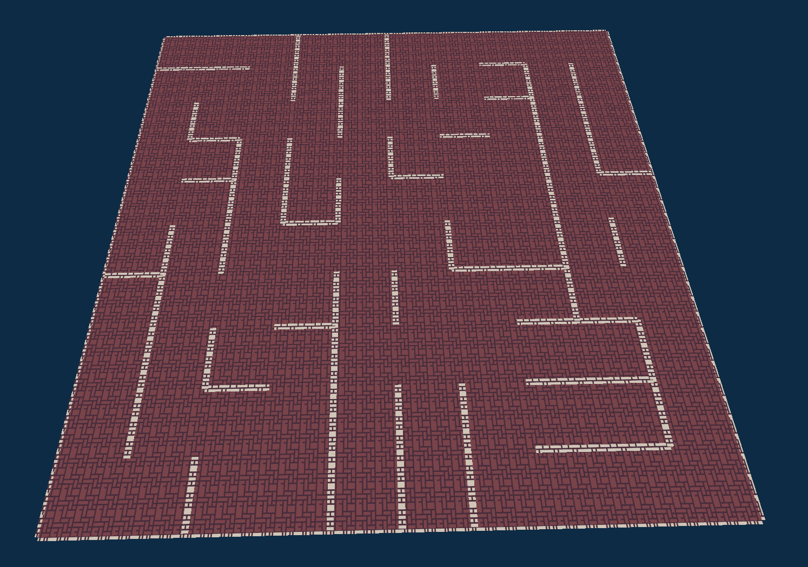

# 3D Browser Game - Maze Explorer

  
  

A fully functional 3D maze game built from scratch using only HTML, CSS, and JavaScript - no external libraries or game engines required.

This project was developed as part of a university course titled **"3D Game Creation for Browsers using HTML, CSS and JavaScript"** held in Liepaja, Latvia.

## Features

- **3D Environment**: Fully functional 3D world with perspective rendering
- **First-Person Controls**:
  - WASD/Arrow keys for movement
  - Mouse look for camera rotation
  - Spacebar for jumping
  - Shift for sprinting
- **Procedural Maze Generation**: Dynamic maze creation using grid-based algorithms
- **Textured Surfaces**: Custom patterns and textures for walls, floors, and objects
- **Physics**: Basic gravity and collision detection

## Getting Started

1. Clone or download this repository
2. Open `index.html` in your web browser
3. Start exploring the maze!
